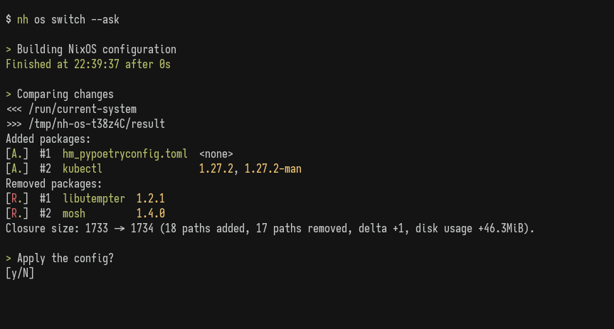

<!-- markdownlint-disable no-inline-html -->
<!-- markdownlint-disable first-line-heading -->
<div align="center">
  <h1>nh</h1>
  <!-- markdownlint-disable line-length -->
  <h6>Because the name "yet-another-<u>n</u>ix-<u>h</u>elper" was too long to type...</h1>
</div>

## What Does it Do?

NH is a modern helper utility aims to consolidate and reimplement some of the
commands from the NixOS ecosystem, including relevant 3rd party tools. Our goal
is to provide a uniform interface with more features, and better ergonomics than
existing commands.

### Platform Specific Subcommands

- `nh os` - reimplements `nixos-rebuild`[^1] with the addition of
  - build-tree displays.
  - diff of changes.
  - confirmation.
- `nh home` - reimplements `home-manager`.
- `nh darwin` - which reimplements `darwin-rebuild`.

[^1]: `nh os` does not yet provide full feature parity with `nixos-rebuild`.
    While a large collection of subcommands have been implemented, you might be
    missing some features. Please visit
    [#254](https://github.com/nix-community/nh/issues/254) for a roadmap.

### Global Subcommands

- `nh search` - a super-fast package searching tool (powered by a ElasticSearch
  client).
- `nh clean` - a re-implementation of `nix-collect-garbage` that also collects
  gcroots.

<p align="center">
  
</p>

## Installation

The latest, tagged version will is available in Nixpkgs as NH stable. This
repository provides the latest development version of NH, which you can get from
the flake outputs.

```sh
nix shell nixpkgs#nh # stable
nix shell github:nix-community/nh # dev
```

### NixOS

We provide a NixOS module that integrates `nh clean` as a service. To enable it,
set the following configuration:

```nix
{ config, pkgs, ... }:
{
  programs.nh = {
    enable = true;
    clean.enable = true;
    clean.extraArgs = "--keep-since 4d --keep 3";
    flake = "/home/user/my-nixos-config";
  };
}
```

Nh supports both Flakes and classical NixOS configurations:

- For flakes, the command is `nh os switch /path/to/flake`
- For a classical configuration:
  - `nh os switch -f '<nixpkgs/nixos>'`, or
  - `nh os switch -f '<nixpkgs/nixos>' -- -I
  nixos-config=/path/to/configuration.nix`
    if using a different location than the default.

You might want to check `nh os --help` for other values and the defaults from
environment variables.

#### Specialisations support

Nh is capable of detecting which specialisation you are running, so it runs the
proper activation script. To do so, you need to give Nh some information of the
spec that is currently running by writing its name to `/etc/specialisation`. The
config would look like this:

```nix
{config, pkgs, ...}: {
  specialisation."foo".configuration = {
    environment.etc."specialisation".text = "foo";
    # ..rest of config
  };

  specialisation."bar".configuration = {
    environment.etc."specialisation".text = "bar";
    # ..rest of config
  };
}
```

#### Home-Manager

Home specialisations are read from `~/.local/share/home-manager/specialisation`.
The config would look like this:

```nix
{config, pkgs, ...}: {
  specialisation."foo".configuration = {
    xdg.dataFile."home-manager/specialisation".text = "foo";
    # ..rest of config
  };

  specialisation."bar".configuration = {
    xdg.dataFile."home-manager/specialisation".text = "bar";
    # ..rest of config
  };
}
```

## Hacking

Contributions are always welcome. Just clone the repository and run
`nix develop.` We also provide a `.envrc` for Direnv users.

Once your changes are complete, remember to run [fix.sh](./fix.sh) to apply
general formatter and linter rules that will be expected by the CI.

Lastly, update the [changelog](/CHANGELOG.md) and open your pull request.

## Attributions

[nix-output-monitor]: https://github.com/maralorn/nix-output-monitor
[dix]: https://github.com/bloxx12/dix

NH would not be possible without that nh runs under the hood:

- Tree of builds with [nix-output-monitor].
- Visualization of the upgrade diff with [dix].
- And of course, all the [crates](./Cargo.toml) we depend on.

## Status

[](https://deps.rs/repo/github/nix-community/nh)

[](https://repology.org/project/unit/versions)
